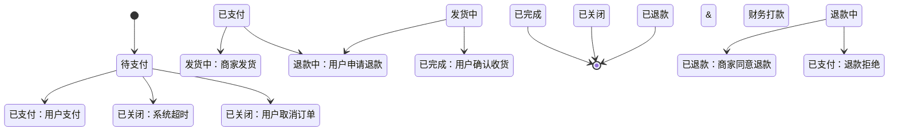
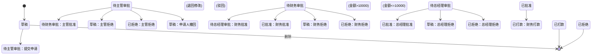

# 复杂业务状态流转（State Transition）生成器

**版本**: v1.0
**适用场景**: 订单系统、工作流审批、状态机驱动的业务模块
**模板编号**: STM-001

---

## 模板定义

```markdown
# Role: 资深业务分析师/自动化测试专家

# Context:
我们需要对 [模块名称：{{module_name}}] 的生命周期进行全路径覆盖测试。
该模块涉及多个状态切换及权限校验。

# Definition of States:
{{state_list}} (例如：待支付，已支付，退款中，已关闭)

# Definition of Actions:
{{action_list}} (例如：用户点击支付，系统超时，商家确认退款)

# Task:
1. 请绘制出该业务流程的状态转换矩阵
2. 生成覆盖所有"状态 - 动作"路径的测试用例

# Constraints:
1. 必须识别并指出"非法转换"（例如：从"待支付"直接跳到"已完成"）
2. 每条用例需包含前置条件（Pre-condition）
3. 使用 Mermaid 语法输出状态转换图源码

# Output Format:
1. Mermaid 状态图
2. 测试用例列表（包含：初始状态 -> 触发动作 -> 目标状态 -> 校验点）
```

---

## 使用示例

### 示例 1：电商订单状态流转

**输入变量**：
- `module_name`: 订单管理系统
- `state_list`: 待支付、已支付、发货中、已完成、已关闭、退款中、已退款
- `action_list`:
  - 用户支付
  - 系统超时 (30 分钟未支付)
  - 商家发货
  - 用户确认收货
  - 用户申请退款
  - 商家同意退款
  - 财务打款
  - 用户取消订单

**预期输出**：

#### 1. Mermaid 状态转换图



#### 2. 测试用例矩阵

| 用例编号 | 初始状态 | 触发动作 | 目标状态 | 校验点 | 优先级 |
| :--- | :--- | :--- | :--- | :--- | :--- |
| TC-STM-01 | 待支付 | 用户支付成功 | 已支付 | 订单状态更新，库存锁定 | P0 |
| TC-STM-02 | 待支付 | 30 分钟超时 | 已关闭 | 订单自动关闭，库存释放 | P0 |
| TC-STM-03 | 待支付 | 用户取消订单 | 已关闭 | 订单关闭，发送通知 | P1 |
| TC-STM-04 | 已支付 | 商家发货 | 发货中 | 物流信息录入，通知用户 | P0 |
| TC-STM-05 | 已支付 | 用户申请退款 | 退款中 | 退款工单创建 | P1 |
| TC-STM-06 | 发货中 | 用户确认收货 | 已完成 | 订单完成，结算打款 | P0 |
| TC-STM-07 | 发货中 | 用户申请退款 | 退款中 | 暂停物流，介入处理 | P1 |
| TC-STM-08 | 退款中 | 商家同意 + 财务打款 | 已退款 | 退款完成，订单关闭 | P0 |
| TC-STM-09 | 退款中 | 商家拒绝 | 已支付 | 恢复订单状态，通知用户 | P2 |

#### 3. 非法转换检测

| 用例编号 | 初始状态 | 触发动作 | 预期目标 | 实际结果 | 说明 |
| :--- | :--- | :--- | :--- | :--- | :--- |
| TC-STM-INV-01 | 待支付 | 商家发货 | 发货中 | 操作不可用 | 未支付不能发货 |
| TC-STM-INV-02 | 待支付 | 用户确认收货 | 已完成 | 操作不可用 | 未支付不能确认收货 |
| TC-STM-INV-03 | 已完成 | 用户申请退款 | 退款中 | 提示：已完成订单请通过售后通道处理 | 不走标准退款流程，引导至售后 |
| TC-STM-INV-04 | 已关闭 | 用户支付 | 已支付 | 支付失败 | 已关闭订单不能支付 |

---

### 示例 2：审批工作流状态流转

**输入变量**：
- `module_name`: 费用报销审批流
- `state_list`: 草稿、待主管审批、待财务审批、待总经理审批、已批准、已拒绝、已打款
- `action_list`:
  - 提交申请
  - 主管批准/拒绝
  - 财务批准/拒绝
  - 总经理批准/拒绝
  - 财务打款
  - 申请人撤回

**预期输出**：

#### 1. Mermaid 状态转换图



#### 2. 测试用例矩阵

| 用例编号 | 初始状态 | 触发动作 | 目标状态 | 校验点 | 优先级 |
| :--- | :--- | :--- | :--- | :--- | :--- |
| TC-STM-10 | 草稿 | 提交申请 | 待主管审批 | 生成审批单，通知主管 | P0 |
| TC-STM-11 | 待主管审批 | 主管批准 | 待财务审批 | 审批流转，通知财务 | P0 |
| TC-STM-12 | 待主管审批 | 主管拒绝 (退回) | 草稿 | 可修改后重新提交 | P1 |
| TC-STM-13 | 待主管审批 | 主管拒绝 (驳回) | 已拒绝 | 流程终止 | P1 |
| TC-STM-14 | 待主管审批 | 申请人撤回 | 草稿 | 可重新编辑提交 | P2 |
| TC-STM-15 | 待财务审批 | 财务批准 (金额≤10000) | 已批准 | 跳过总经理审批 | P0 |
| TC-STM-16 | 待财务审批 | 财务批准 (金额>10000) | 待总经理审批 | 流转至总经理 | P0 |
| TC-STM-17 | 待总经理审批 | 总经理批准 | 已批准 | 进入打款队列 | P0 |
| TC-STM-18 | 已批准 | 财务打款 | 已打款 | 打款记录，流程完成 | P0 |

---

## 测试覆盖度检查清单

使用此模板时，请确保覆盖以下场景：

- [ ] **所有合法状态转换** 已生成测试用例
- [ ] **所有非法状态转换** 已识别并记录
- [ ] **中间状态撤回/取消** 场景已覆盖
- [ ] **超时/自动流转** 场景已覆盖
- [ ] **并行审批/会签** 场景已覆盖（如适用）
- [ ] **回滚/退回修改** 场景已覆盖
- [ ] **异常中断恢复** 场景已覆盖

---

## 变更记录

| 版本 | 日期 | 作者 | 变更说明 |
| :--- | :--- | :--- | :--- |
| v1.0 | 2026-03-22 | QA Team | 初始版本 |
